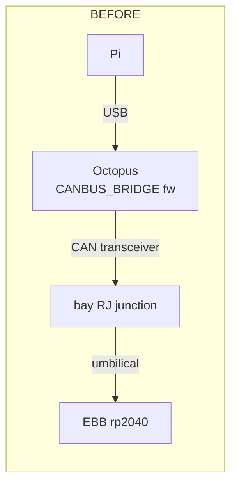
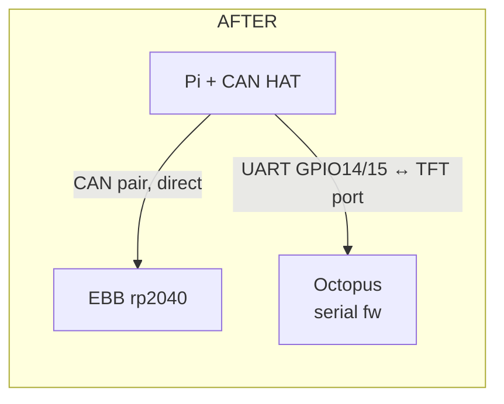

# CAN HAT + USB Removal — Wiring & Cutover

Waveshare MCP2518FD CAN HAT on the Pi (EBB direct), Octopus moved to UART on
the Pi's GPIO serial, Pi power hardwired. **USB leaves the print path
entirely.** Written 2026-09-05 for the bay surgery. Assumes the **Waveshare
2-CH CAN FD HAT** (isolated, dual MCP2518FD) — if the silkscreen says another
model, verify the dtoverlay lines against its Waveshare wiki page first.

## Topology: before → after





Deleted from the system: Octopus USB cable, Octopus CAN transceiver module,
bay RJ junction, Pi USB-C power. Zero USB anywhere.

## What stays / what goes

| Item | Fate |
|---|---|
| Umbilical CAN pair | → HAT CAN_0 screw terminals (direct, RJ junction deleted) |
| Umbilical power leg (24V/GND) | unchanged — bay 24V distribution feeds the EBB |
| Octopus USB → Pi | **REMOVED** — replaced by 3-wire UART (below) |
| Octopus CAN transceiver module | off the bus, disconnected |
| Pi USB-C power | replaced by GPIO 5V from the NEW 24V→5V converter |
| mini12864 | unaffected (Octopus EXP headers; rides whatever link the Octopus has) |

## Physical wiring

### 1. HAT onto the Pi

Stacks on the 40-pin header. Uses SPI0 (CE0/GPIO8 = CAN_0, CE1/GPIO7 = CAN_1)
+ interrupts GPIO25/GPIO24. It does NOT use the UART pins (GPIO14/15) or the
5V injection pins — no conflicts with anything below.

### 2. EBB bus → HAT CAN_0

```
  HAT CAN_0 screw terminal
  ┌─────────────┐
  │  H  ────────┼───── umbilical CAN_H ┐ twisted pair,
  │  L  ────────┼───── umbilical CAN_L ┘ straight run, no junction
  │  GND ───────┼───── bay ground distribution (isolated HAT NEEDS this reference)
  └─────────────┘
```

**AS BUILT 2026-09-07 (verified working): yellow = CAN_H, green = CAN_L,
black = GND.** A swap is harmless to hardware but kills all comms (the
symptom: `No buffer space available`, berr tx climbing, rx=0).

EBB power (24V/GND) stays on the bay
distribution — the HAT is data-only. Today's finding still applies: EBB
brownout/hang is a power-path failure; inspect the EBB power leg connectors
while you're in there.

**Termination: exactly two** — HAT CAN_0 120R jumper ON + EBB's existing 120R
ON. Octopus transceiver is gone from the bus.

### 3. Octopus ↔ Pi UART (replaces USB)

Use the Octopus **TFT port** (USART1: TX=PA9, RX=PA10). Three wires, crossed:

| Pi GPIO header | Signal | Octopus TFT port |
|---|---|---|
| pin 8 (GPIO14, TXD) | Pi TX → Octopus RX | RX (PA10) |
| pin 10 (GPIO15, RXD) | Pi RX ← Octopus TX | TX (PA9) |
| pin 14 (GND) | common ground | GND |

- **Do NOT connect the TFT port's 5V pin.** Both boards are self-powered.
- Both sides are 3.3V logic — no level shifter.
- Keep the run short/twisted; it lives in the bay next to 24V wiring.
- Pins 8/10/14 are passed through by the HAT — grab them on the HAT's
  stacking header, or jumper-wire from the pass-through positions.
- Verify against your board's silkscreen: BTT Octopus v1.x TFT port order is
  typically `5V GND RX TX` — confirm before landing wires.

### 4. Pi power: hardwired 5V into GPIO

From the **replacement** 24V→5V converter (old one is a suspect — retire it):

| Converter | GPIO header |
|---|---|
| +5.1V | pins **2 and 4** (both, splits current) |
| GND | pin **6** (+ pin 9 optional) |

Set point 5.1V, 3A+ (Pi 4B), short 18-20AWG leads. **USB-C stays empty
forever.** GPIO power bypasses the Pi's input protection — the converter's
set point and tight terminals are the protection now.

## Software cutover

### 1. Pi `/boot/firmware/config.txt`

```ini
dtparam=spi=on
dtoverlay=mcp251xfd,spi0-0,interrupt=25   # CAN_0 ← EBB bus
enable_uart=1
dtoverlay=disable-bt                      # frees PL011 → stable /dev/ttyAMA0 on GPIO14/15
```

Also remove the serial console: delete `console=serial0,115200` from
`/boot/firmware/cmdline.txt` (or `raspi-config` → Interface → Serial: login
shell OFF, serial port ON), and `systemctl disable --now serial-getty@ttyAMA0`.

Existing `25-can.network` (1M bitrate) matches can0 and carries over. No
gs_usb anymore, so no interface naming race.

### 2. Octopus firmware: bridge → serial

Build (base: `~/firmware/octopus-733.config`; katapult stays at 32KiB offset):

- STM32F446, 32KiB bootloader offset, 12MHz crystal (as before)
- Communication: **Serial (on USART1 PA10/PA9)** — the TFT port
  (`CONFIG_LOW_LEVEL_OPTIONS=y` to see the choice list; USB-CAN bridge OFF)

**Flash this over USB while the cable is still attached** (the Octopus's
current bridge firmware does not listen on UART — no flash, no comms):
`flashtool.py -d /dev/serial/by-id/<octopus> -r` → katapult → flash via
`/dev/ttyACM0` as done for -733.

NOTE: katapult on this Octopus is a USB build, so future klipper reflashes
(rare) also want the USB cable plugged in temporarily — the cable is demoted
to a flashing dongle, not eliminated from the drawer. (Trigger the bootloader
from the UART side with `flashtool.py -d /dev/ttyAMA0 -r`, then flash over
USB/ttyACM0. Rebuilding katapult itself for UART would need BOOT0+DFU — not
worth it.)

### 3. printer.cfg

```diff
 [mcu]
-canbus_uuid: e987337ec18e
+serial: /dev/ttyAMA0
+restart_method: command
```

`restart_method: command` because there's no USB DTR line to toggle. Caveat it
inherits: a fully HUNG Octopus can't be restarted by command — that's the
physical reset button / power cycle, same as today.

`config/rp2040-canbus.cfg` (`[mcu EBBCan] canbus_uuid: b129d1ca9b9b`): **no
change** — same uuid, same `can0`, now served by the HAT.

## Bring-up order (one variable at a time)

1. **Flash the Octopus serial firmware first**, over USB, before rewiring
   (it's the last thing USB is good for).
2. Wire everything: HAT, CAN pair, UART, Pi 5V. Remove the USB cable.
3. Boot. `dmesg | grep -i mcp251xfd` → chip found; `ip link` → can0 UP 1M.
4. `ls -l /dev/ttyAMA0` exists; nothing else owns it (`fuser /dev/ttyAMA0`).
5. Klippy still down → raw CAN query: `~/klippy-env/bin/python
   ~/katapult/scripts/flashtool.py -i can0 -q` → **b129d1ca9b9b Application: Klipper**.
6. Update printer.cfg `[mcu]`, `FIRMWARE_RESTART` → **ready**, mini12864 lights.
7. Monitor on (`/tmp/can_monitor.sh` pattern), then G28 + QGL — the historical
   killer load. Success = flat error counters.
8. 30-min idle soak with `M104 S215` heat phase (today's 15:26 failure mode),
   then `M104 S0`.

**Fallback if UART fights back:** rebuild firmware for plain USB
(PA11/PA12), plug the USB cable back in, `[mcu] serial:
/dev/serial/by-id/usb-Klipper_stm32f446xx_...` — the HAT/EBB side is
independent and stays as wired.
