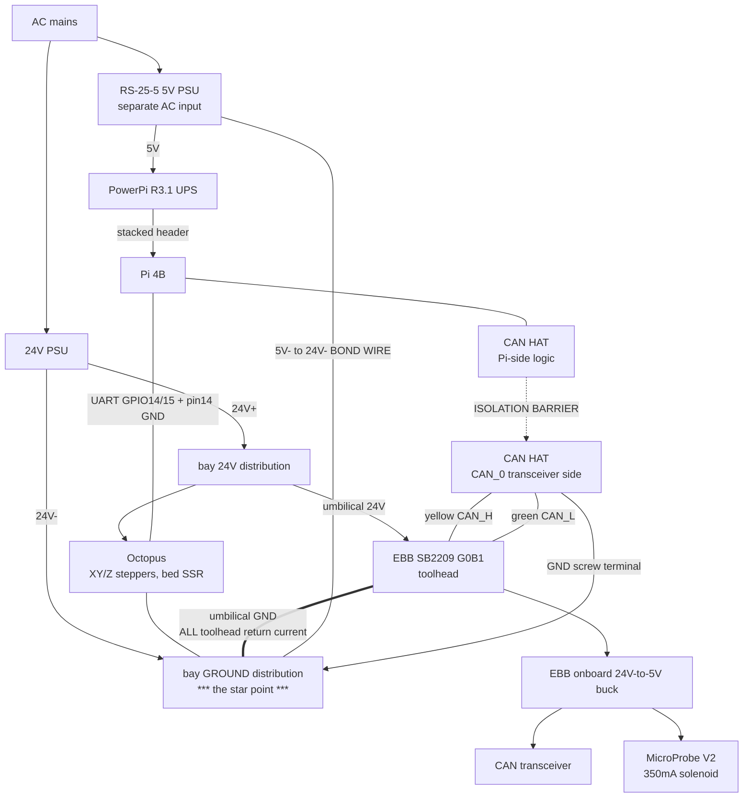

# System Grounding Map

Single-diagram view of every ground path in the machine, written 2026-09-15
during the MicroProbe CAN-error investigation (see
[SB2209-G0B1-SWAP.md](SB2209-G0B1-SWAP.md)). Sources: `CAN-HAT-WIRING.md`
(as-built 2026-09-07), `POWER-AND-SHUTDOWN.md`, `powerpi/README.md`.

Marked **[VERIFY]** where the topology is inferred from docs rather than
confirmed by measurement.

## The whole picture



## Bus ends in detail

The two terminating ends are **not symmetric**, and the asymmetry is the whole
story. Termination is identical at both; the reference and the supply are not.

### End A - CAN HAT (host side)

```
                            Pi 4B
                              |  SPI0: CE0/GPIO8, IRQ GPIO25
    +-------------------------+------------------------------------------+
    |  Waveshare 2-CH CAN FD HAT                   [VERIFY parts]        |
    |                                                                    |
    |   MCP2518FD      ||        CAN transceiver                         |
    |   controller <---||------->   (CAN_0)                              |
    |                  ||               |                                |
    |   Pi 5V --> DCDC ||--> iso Vcc ---+                                |
    |   (logic side)   ||    TRANSCEIVER ONLY                            |
    |               ISOLATION                                            |
    |                BARRIER      120R jumper: ON                        |
    |                                   +---[120R]---+                   |
    |                                   |            |                   |
    +-----------------------------------+------------+-------------------+
                                        |            |
                              H <-------+            |
                              L <--------------------+
                            GND <-- short, dedicated wire --> BAY GROUND DISTRIBUTION
```

Supply feeding this transceiver: **isolated and dedicated**, no other load.
Ground reference conductor: **dedicated**, carries no load current.

### End B - EBB SB2209 G0B1 (toolhead side)

```
              umbilical 24V                umbilical GND
                    |                            |
                    v                            v
    +---------------+----------------------------+------------------------+
    |  EBB SB2209 G0B1                                                    |
    |               |                            |                        |
    |         onboard buck                       |                        |
    |               |                            |                        |
    |          5V RAIL                   EBB GROUND PLANE                 |
    |             |    |                         |                        |
    |             |    +--> P5 pin 2 --> probe---+ 350mA solenoid         |
    |             |                              |                        |
    |             +--> CAN transceiver           +-- hotend heater PB13   |
    |                      |                     +-- extruder stepper     |
    |               120R jumper ON               +-- fans PA0/PA1, ADXL   |
    |            +---[120R]---+                  |                        |
    |            |           |                   |                        |
    +------------+-----------+-------------------+------------------------+
                 |           |                   |
               CAN_H       CAN_L             to umbilical GND
               yellow      green
```

Supply feeding this transceiver: **shared with the 350mA probe**.
Ground reference conductor: **shared with every toolhead load** - the
hotend heater alone is roughly 2A at 24V.

### Side by side

| | End A (HAT) | End B (EBB) |
|---|---|---|
| Termination | 120R jumper ON | 120R jumper ON |
| Controller | MCP2518FD over SPI | STM32G0B1 hardware FDCAN, PB0/PB1 |
| Transceiver supply | isolated rail, **nothing else on it** | onboard 5V, **shared with probe** |
| Ground reference | dedicated wire to bay star point | umbilical GND, **shared with all loads** |
| Load current in that reference | none | hotend, extruder, fans, probe |
| Can a local transient move it? | no | **yes** |

Both ends terminate correctly — that is what the 59R confirms, and the wiggle
test confirms the conductors between them are sound. But a correct termination
says nothing about whether the two transceivers agree on where zero volts is.
End A's reference cannot move. End B's reference moves whenever the toolhead
draws current, and the probe is the only load that steps hard with nothing else
running.

That is the asymmetry, and it is why every intervention below is at End B.

## Ground domains

| # | Domain | Where it is referenced |
|---|--------|------------------------|
| 1 | Mains earth | PSU chassis, frame |
| 2 | **24V return / bay ground** | PSU 24V-, the distribution block |
| 3 | Pi / logic ground | Pi, HAT logic side, PowerPi, RS-25-5 output |
| 4 | HAT CAN-side ground | isolated; referenced only by the CAN_0 GND screw terminal |

Domain 2 is the one that carries current: XY/Z steppers, the bed SSR path,
and everything on the toolhead. Domain 4 exists precisely so the CAN bus can
sit on its own reference, which is what makes the next section matter.

## Finding 1: the CAN bus has no dedicated ground conductor (structural)

As built, the two ends of the CAN bus get their ground reference from
different wires:

- **HAT end:** CAN_0 GND terminal, short wire to the bay ground distribution.
- **EBB end:** the umbilical's power-leg GND. There is no third conductor
  running alongside CAN_H/CAN_L.

So the CAN transceivers' shared reference passes through the umbilical ground
wire, which is simultaneously the return path for **every load on the
toolhead**: hotend heater (PB13, ~2A at 24V), extruder stepper, both fans, the
ADXL, and the probe. Every amp through that wire develops a drop, and that
drop appears directly as **common-mode voltage between the two ends of the
bus**. CAN transceivers tolerate only a limited common-mode range before the
receiver misreads bits.

This is not a fault. It is the normal Voron umbilical arrangement, and it
works fine most of the time. But it is the mechanism by which a toolhead-local
current transient becomes a bus-wide signal-integrity problem, and it is the
best structural explanation available for errors that appear on probe
actuation with a verified-good 24V rail and a verified-good 59R pair.

## Finding 2: probe return current shares the EBB ground plane

The MicroProbe's return lands on P5 pins 1/4, into the EBB's ground plane,
which is also the CAN transceiver's ground reference, and then out the
umbilical. A 350mA step with a solenoid's inductive character, injected a few
millimetres from the transceiver's ground pin, bounces that reference.

This is a **second, independent mechanism** from the 5V rail sag already
suspected. Both are local to the EBB, both are triggered by actuation, and
both are addressed by the same first intervention: local bulk capacitance at
P5, which supplies the transient on the spot instead of pulling it through
the umbilical.

Note this is why the test matters more than the theory. A separate 5V feed for
the probe distinguishes them; bulk capacitance treats both.

## Finding 3: host-domain ground loop (CONFIRMED 2026-09-15)

Walked with the owner 2026-09-15. The Pi's 5V is **not** the 24V-to-5V
converter the other docs describe - it is a **Mean Well RS-25-5**, a separate
supply on its own AC input, with a deliberate bond wire tying its 5V- to the
PSU 24V-. That bond closes a loop:

- Path A: Pi GND -> UART ground wire (header pin 14) -> Octopus GND
- Path B: Pi GND -> RS-25-5 5V- -> bond wire -> PSU 24V- -> Octopus power GND

Motor/heater return current divides between the Octopus's heavy 24V return
and the thin UART ground jumper by conductance - order 100mA of stepper
return in a signal reference during motion. The CAN bus is protected from
this by the HAT's isolation barrier; the UART link to the Octopus is not,
and that link is the only path to the main MCU since USB was removed.

**Because the RS-25-5 output is isolated, the fix is removing the bond
wire.** The Pi domain then references 24V- through exactly one point - the
UART ground at the Octopus - which carries only signal return. Precondition:
verified that no other conductor ties the Pi/5V domain to the 24V domain
(Ethernet is magnetics-isolated, the HAT is isolated, PowerPi and the GPIO17
divider live inside the 5V domain). With the bond gone the UART ground is
the sole reference and must stay connected.

Not implicated in the probe CAN errors - separate domain, separate fix.

## Finding 4: what is actually correct

Worth stating plainly, because most of this is right:

- **Exactly two terminators** (HAT 120R jumper + EBB 120R), measured 59R.
  Correct, and the wiggle test at 59R rules out an intermittent splice.
- **Isolated CAN HAT** is the right part for this topology.
- **CAN pair twisted, straight run, no junction** since the RJ bay junction
  was deleted 2026-09-07. Correct.
- **TFT port 5V deliberately not connected** — both boards self-powered, so no
  contention. Correct.
- **HAT CAN-side GND is referenced.** An isolated transceiver with a floating
  ground is a classic failure; this one is tied. Correct.
- **Both CAN ground references land at the PSU 24V- terminal bank** (HAT wire
  direct to a screw; umbilical GND on the same internally-bussed bar,
  confirmed 2026-09-15). No load current between the two landing points -
  the frame end is as clean as this architecture allows. The only remaining
  common-mode source is the umbilical GND drop itself (Finding 1).

## Recommended changes, in order

1. **Bulk capacitance at the EBB P5 connector** — 470uF-1000uF electrolytic
   across 5V/GND, watch polarity. Addresses Findings 1 and 2 together, five
   minutes of work, and is a legitimate permanent fix if it works.
2. **Separate 5V feed for the probe** (bench supply or a 24V-to-5V buck
   mounted at the toolhead, grounded at the EBB) — the diagnostic that
   separates rail sag from ground bounce.
3. **Dedicated CAN ground conductor** — if the umbilical has a spare wire,
   run it from the HAT CAN_0 GND terminal to EBB ground and move the HAT's
   reference off the bay distribution onto it. This is the structural fix for
   Finding 1 and would make the bus immune to toolhead return current. Do this
   only after 1 and 2, and change nothing else at the same time.
4. **Remove the RS-25-5 5V- to 24V- bond wire** (Finding 3, confirmed) -
   breaks the Pi<->Octopus ground loop; the UART ground becomes the single
   clean reference. Unrelated to the probe fault; do it on its own, not
   bundled with a probe experiment.

## Do not

- **Do not power the probe from the Pi's 5V.** Its 350mA return would flow the
  length of the umbilical back to the Pi, shifting the CAN ground reference by
  exactly the mechanism in Finding 1 — injecting a new fault while testing for
  an old one, and risking a Pi brownout through the PowerPi.
- **Do not ground a test supply at the Pi, the HAT, or the PSU chassis.**
  Single point, at the EBB.
- **Do not add a third terminator.** 59R is correct; 40R is not.
